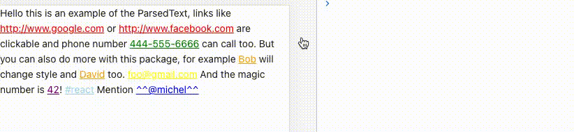

Fork from [react-native-parsed-text](https://github.com/taskrabbit/react-native-parsed-text)

# React Parsed Text

This library allows you to parse a text and extract parts using a `RegExp` or predefined patterns.
Currently there are 3 predefined types: `url`, `phone` and `email`.

All the props are passed down to a new `Text` Component if there is a matching text. If those are functions they will receive as param the value of the text.

## Proptypes

`parse`: Array of parsed text.

- to use the predefined type: `{type: 'url'}`.
- to use your own `RegExp`: `{pattern: /something/}`.

`renderText`: Function called to change the displayed children.

`childrenProps` : Properties to pass to the children elements generated by react-parsed-text.

eg:
Your str is `'Mention [@michel:5455345]'` where 5455345 is ID of this user and @michel the value to display on interface.
Your pattern for ID & username extraction : `/\[(@[^:]+):([^\]]+)\]/i`
Your renderText method :

```
renderText(matchingString, matches) {
  // matches => ["[@michel:5455345]", "@michel", "5455345"]
  let pattern = /\[(@[^:]+):([^\]]+)\]/i;
  let match = matchingString.match(pattern);
  return `^^${match[1]}^^`;
}
```

Displayed text will be : `Mention ^^@michel^^`
## Install

`npm install --save react-parsed-text`

## Example

```javascript
import React, { useCallback } from 'react';
import { ParsedText, ParseShape } from 'react-parsed-text';

const Example: React.FC = () => {
  const handleUrlPress: ParseShape['onClick'] = useCallback((url) => {
    console.log(url);
  }, []);
  const handlePhonePress: ParseShape['onClick'] = useCallback((phone) => {
    console.log(phone);
  }, []);
  const handleEmailPress: ParseShape['onClick'] = useCallback((email) => {
    console.log(email);
  }, []);
  const handleNamePress: ParseShape['onClick'] = useCallback((name) => {
    console.log(name);
  }, []);
  const renderText: ParseShape['renderText'] = useCallback((matchingString) => {
    // matches => ["[@michel:5455345]", "@michel", "5455345"]
    const pattern = /\[(@[^:]+):([^\]]+)\]/i;
    const match = matchingString.match(pattern);
    return `^^${match[1]}^^`;
  }, []);

  return (
    <ParsedText
      parse={[
        { type: 'url', className: 'parsed-url', onClick: handleUrlPress },
        { type: 'phone', className: 'parsed-phone', onClick: handlePhonePress },
        { type: 'email', className: 'parsed-email', onClick: handleEmailPress },
        { pattern: /Bob|David/, className: 'parsed-name', onClick: handleNamePress },
        {
          pattern: /\[(@[^:]+):([^\]]+)\]/i,
          className: 'parsed-username',
          onClick: handleNamePress,
          renderText: renderText,
        },
        { pattern: /42/, className: 'parsed-magic-number' },
        { pattern: /#(\w+)/, className: 'parsed-has-tag' },
      ]}>
      Hello this is an example of the ParsedText, links like http://www.google.com or http://www.facebook.com are
      clickable and phone number 444-555-6666 can call too. But you can also do more with this package, for example Bob
      will change style and David too. foo@gmail.com And the magic number is 42! #react Mention [@michel:5455345]
    </ParsedText>
  );
};
```


